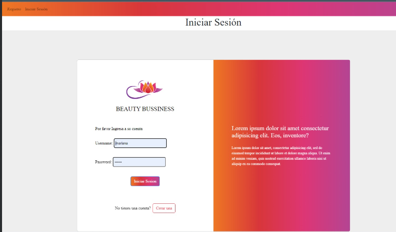
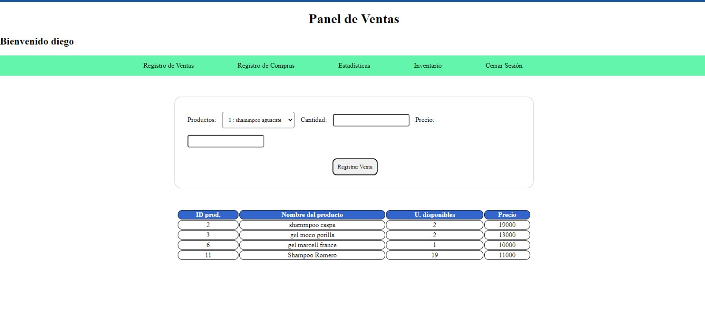

# Beauty_app

This is a project that seeks to improve the process and user experience as the owner of a business selling beauty products, allowing for this phase No. 1 the following aspects:

* Creating the product registration view.
* Implementation of the login view
* Implementation of the logout view
* route protection authentication
* Implementation of the user interface
* creation of the database architecture

This first advance is part of a process that will allow users to finally automate inventory ordering, where the same system is in charge of informing the user about the shortage of a product and, if necessary, generate the order and carry out the dispatch order also like control of inventory in real time.

## Tools
 * postgres 12.12
 * Django 4.1.5
 * redis 4.3
 * Boostrap
 * ubunto 20.04

## Examples of use (local)

* Create a virtual enviroment
* install requirements.txt pip install requirements.txt
* git clone https://github.com/diegojojoayandun/Beauty_Business_DJ
* inside the folder where the manage.py file is located, type

python3 manage.py makemigration
python3 manage.py migrate

## Authors

Daniel Ruiz - [Github](https://github.com/ruizdani301)
diego jojoa - [Github](https://github.com/diegojojoayandum)

First part of Beauty_app: daniel ruiz, diego jojoa